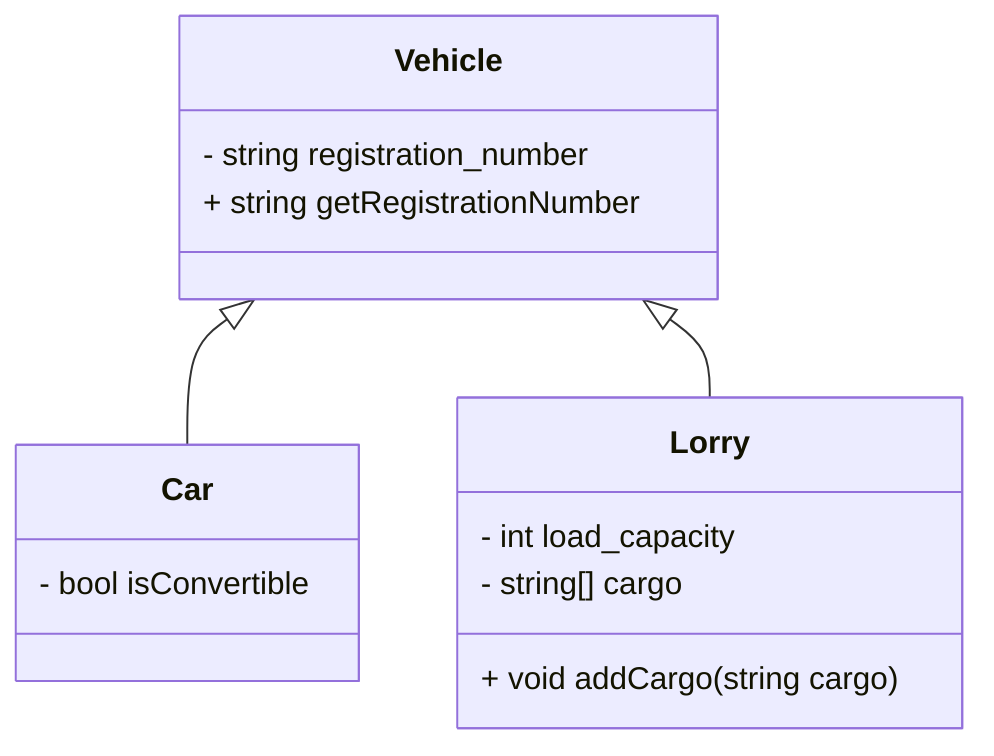

---
tags:
  - AQA-A-Level
  - Computer-Science
  - Task
---
# Class Diagram Example

```mermaid
classDiagram
Vehicle <|-- Car
Vehicle <|-- Lorry

class Vehicle{
	- string registration_number
	+ string getRegistrationNumber
}

class Car{
	- bool isConvertible
}

class Lorry{
	- int load_capacity
	- string[] cargo
	+ void addCargo(string cargo)
}
```
