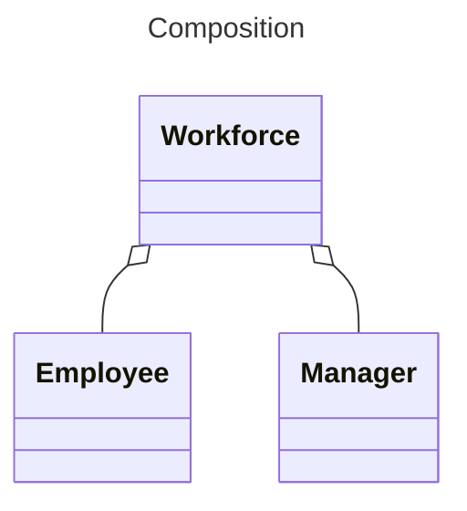
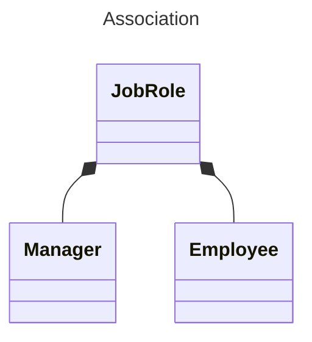

---
tags:
  - AQA-A-Level
  - Computer-Science
  - Note
page: 51
---
# Aggregation
> [!definition]
> Aggregation is when a class uses an object or many objects made from other classes.

An example in real-life would include:
- Managers and Employees make up the work force.
- Job roles can be taken on by managers or employees.
- Job roles define what the managers and employees do as part of the workforce.

In C++ this would look like:
```cpp
#include <iostream>
#include <vector>

using std::string;
using std::vector;

class JobRole{
	public:
		JobRole(string job_role) :
			m_job_role(job_role)
			{}
		
		string getJobRole(){
			return m_job_role;
		}
	
	private:
		string m_job_role;
};

class Employee{
	public:
		Employee(string name) : name(name) {};
		
		string name;
		vector<JobRole> job_roles;
		
		void addRole(string job_role){
			job_roles.push_back(JobRole(job_role));
		}
		
		string profile(){
			return name + ": \n" + listJobRoles();
		}
	
	private:
		string listJobRoles(){
			string list;
			for(int i = 0; i < job_roles.size(); i++){
				list += "- " + job_roles[i].getJobRole();
				if(i != job_roles.size() - 1){
					list += '\n';
				}
			}
			return list;
		}
};

class Manager : public Employee{
	public:
        Manager(string name) : Employee(name){       // Use Employee constructor
            job_roles.push_back(JobRole("Manager"));
        }
};

class Workforce{
	public:		
		void add(Employee employee){
			employees.push_back(employee);
		}

		void add(vector<Employee> new_employees){       // Overloading add()
			for(Employee employee : new_employees){
				employees.push_back(employee);
			}
		}
		
		void printEmployees(){
		    string seperator = "\n------------------\n";
			int max_index = employees.size() - 1;
			
		    for(int i = 0; i < employees.size(); i++){
		        Employee employee = employees[i];
		        std::cout << employee.profile() << std::endl;
		        if(i != max_index){
		            std::cout << seperator;
		        }
		        std::cout << std::endl;
		    }
		}
	
	private:
		vector<Employee> employees;
};

int main(){
    Workforce workforce;

	Manager jane_doe("Jane Doe");
	jane_doe.addRole("Board Member");
	workforce.add(jane_doe); // Single Add
    
	Employee john_smith("John Smith");
	john_smith.addRole("Technician");
	john_smith.addRole("Engineer");

	Employee foo_bar("Foo Bar");
	foo_bar.addRole("Customer Support Representitve");

	workforce.add({john_smith, foo_bar}); // Multi-Add
	
    workforce.printEmployees();
	
	return 0;
}

/*
 * OUTPUT: 
 *   Jane Doe:
 *   - Manager
 *   - Board Member
 * 
 *   ------------------
 * 
 *   John Smith:
 *   - Technician
 *   - Engineer
 * 
 *   ------------------
 * 
 *   Foo Bar:
 *   - Customer Service Representitve 

 */
```

# Composition Aggregation
>[!definition]
>When a main object has two or more sub-objects. When the main object get's deleted, so do the sub-objects



# Association Aggregation
>[!definition]
> When an object uses another object, but is not directly dependent to it.

