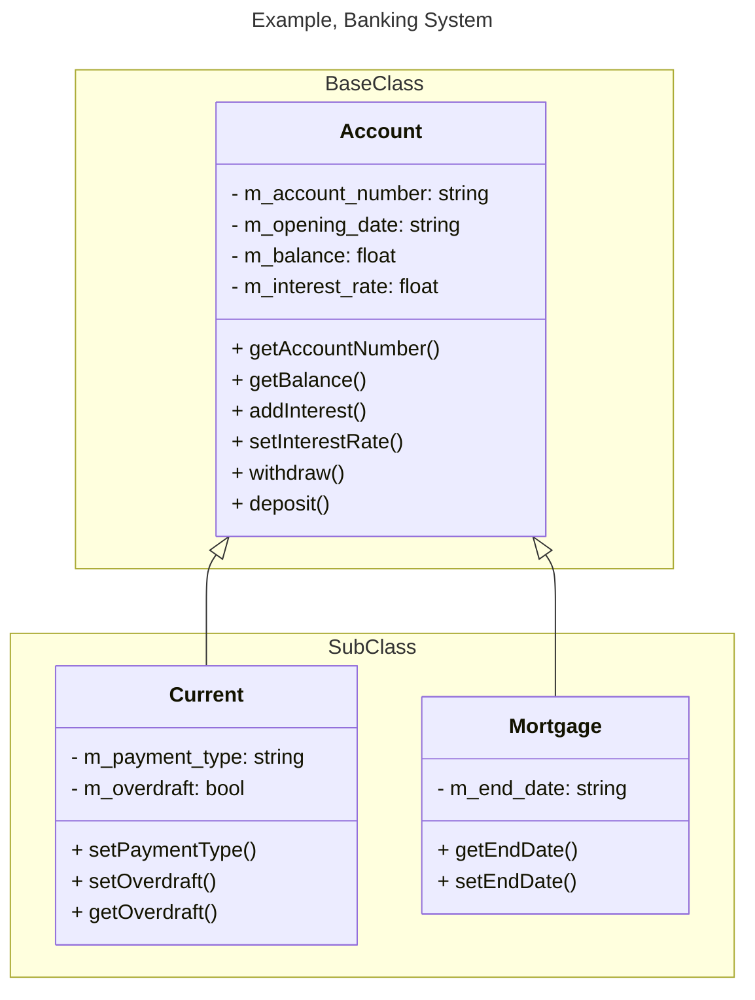

---
tags:
  - AQA-A-Level
  - Computer-Science
  - Note
page: 49
---
# Class Diagrams for Inheritance
>[!definition]
> A standard method for representing classes, their properties and methods, and the relationship between classes

## What are Class Diagrams
- Hierarchal in structure with the base class at the top and the subclasses following underneath.
- A subclass inherits the properties and methods of the base class
- They use arrows to show the direction of inheritance
- Each class is represented with a box made up of three sections
	- Class name
	- Properties
	- Methods
- Use the syntax of `+` and `-` to indicate the visibility of the properties and methods to other classes.
	- `+` means that the properties and methods are public to all classes.
	- `-` means that the properties and methods are private and can only be used in that class.
- Uses the `#` syntax to indicate that the properties and methods are protected so they can be used in that class and any subclass.
- Uses arrows with the arrow pointing to the base class to show where the subclass is inheriting its properties and methods from.
- Define the data types to be used for each variable

