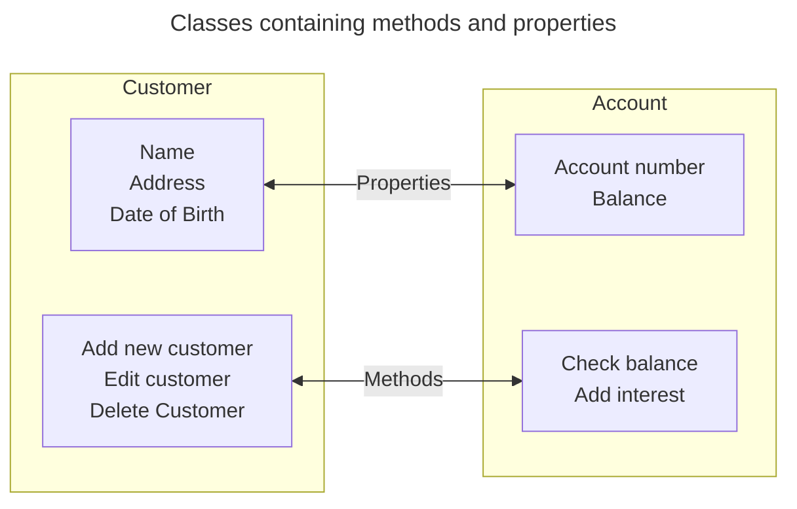

---
tags:
  - AQA-A-Level
  - Computer-Science
  - Note
page: 45
---
# Encapsulation
> [!definition]
> The process of putting properties, methods, and data in an object.

The code inside an object is known as a *"Method"*, these are subroutines and functions contained in the object to manipulate the object's data.
The process of manipulating the data only inside an object is sometimes referred to as *"information hiding"*. This means that code outside the class can only access the data via defined methods.



# Classes and Objects
The two building blocks of an OOP are *classes* and *objects*.
- *Classes* are a template for objects. They store the methods and any hardcoded data, however they cannot be called upon.
- *Objects* are an instance of a class.

In the banking example:
- An `Account` might be a class which defines the properties of a bank account
- All accounts have similar properties such as `account_nunber` and `current_balance`.
- They also have the same methods - they can `getCurrentBalance` and `addInterest`.
- Each type of account would be a child class of the `Account` class.
	- For example, you could have an `CurrentAccount` class that inherits and adds functionality to the main `Account` class, as well as a `MortageAccount` class that inherits from the main `Account` class.
 - Each of these child classes could then have objects made, representing accounts for individuals.

# Example
```cpp
#include <iostream>

class Account{
	public:
		Account(std::string account_number, double current_balance, 
		double interest_rate): 
			_account_number(account_number), _current_balance(current_balance), 
			_interest_rate(interest_rate){}
		
		std::string getAccountNumber(){
			return _account_number;
		}
		
		double getCurrentBalance(){
			return _current_balance;
		}
		
		double getInterestRate(){
			return _interest_rate;
		}
		
		void addInterestRate(){
			double interest = _current_balance * _interest_rate;
			_current_balance += interest;
		}
		
		void setInterestRate(double new_interest_rate){
			_interest_rate = new_interest_rate;
		}
	
	private:
		std::string _account_number;
		double _current_balance;
		double _interest_rate;
};

int main(int argc, char* argv[]){
	Account john_smith("0123456789", 123.45, 3.14);
	std::cout << 
		"John Smith's Account Number: " << 
		john_smith.getAccountNumber() << 
	std::endl;
}

// OUTPUT: John Smith's Account Number: 0123456789
```