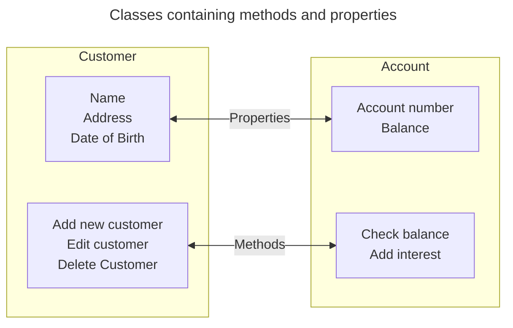

---
tags:
  - AQA-A-Level
  - Computer-Science
  - Note
---
# Encapsulation
> [!definition]
> The process of putting properties, methods, and data in an object.

The code inside an object is known as a *"Method"*, these are subroutines and functions contained in the object to manipulate the object's data.
The process of manipulating the data only inside an object is sometimes referred to as *"information hiding"*. This means that code outside the class can only access the data via defined methods.

