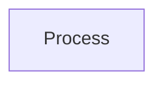
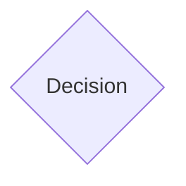
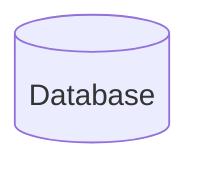
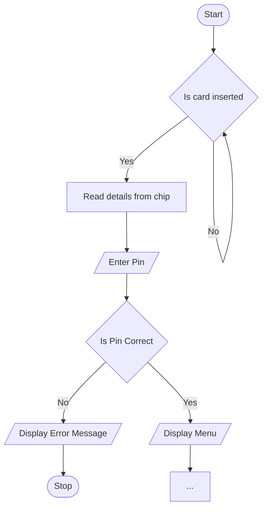

---
tags:
  - AQA-A-Level
  - Computer-Science
  - Note
---
# Flowcharts
A flowchart uses a set of symbols to show the flow of a program.

Some symbols include:

## Start / Stop

## Process

## Input / Output

## Decision

## Database

# System Flowchart
A system flowchart is used to give an overview of an entire system, however not all of a system should be shown as it can get very big and cramped

## ATM Example

