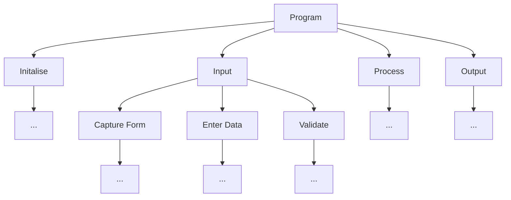

---
tags:
  - AQA-A-Level
  - Computer-Science
  - Note
page: 38
---
# Hierarchy or Structure Charts
A Hierarchy or structure chart is a chart that takes the program and iterates on splitting up the problem to lower and lower details using a top down approach. The flow is organised left to right.

For example:

The further down the tree you look, the more detail you get.