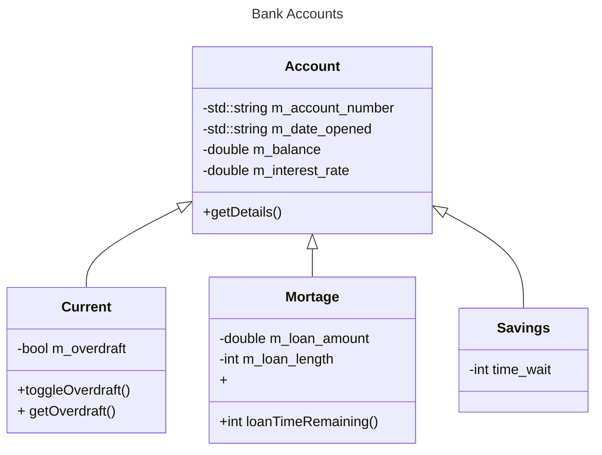

---
tags:
  - AQA-A-Level
  - Computer-Science
  - Note
page: 47
---
# Inheritance
> [!definition]
> Similar to biological inheritance, inheritance in OOP is the act of copying a class and adding features, not being able to remove old ones.

For example, with a bank, you may have an `Account` base class and then a `CurrentAccount` class that it inherits from, and adds an `m_overdraft` property:
```cpp
#include <iostream>
#include <sstream>

class Account{
	public:
		Account(std::string account_number, std::string date_opened, double 
		balance, double interest_rate) : 
			m_account_number(account_number),
			m_date_opened(date_opened),
			m_balance(balance),
			m_interest_rate(interest_rate)
			{}

		std::string getDetails(){
			std::stringstream ss;
			
			ss << 
				"account nunber | " << m_account_number << '\n' <<
				"date opened    | " << m_date_opened << '\n' <<
				"balance        | " << std::to_string(m_balance) << '\n' <<
				"interest rate  | " << std::to_string(m_interest_rate);
				
			return ss.str();
		}
		
	private:
		std::string m_account_number;
		std::string m_date_opened;
		double m_balance;
		double m_interest_rate;
};

class CurrentAccount : public Account{
	public:
		using Account::Account;
		
		void toggleOverdraft(){
			m_overdraft = !m_overdraft;
		}
		
		std::string getOverdraft(){
			std::string overdraft = "overdraft      | ";
			overdraft += (m_overdraft ? "True" : "False");
			return overdraft;
		}
	
	private:
		bool m_overdraft = false;
};

int main(){
	CurrentAccount a("123", "1/1/1970", 100, 0.92);
	a.toggleOverdraft();
	
	std::cout << a.getDetails() << '\n' << a.getOverdraft() << std::endl;
	
	return 0;
}

/*
 * OUTPUT
 *	account nunber | 123
 *	date opened    | 1/1/1970
 *	balance        | 100.000000
 *	interest rate  | 0.920000
 *	overdraft      | True
 */
```

## Inheritance Diagram
The relationship between classes can be shown using an inheritance diagram:


