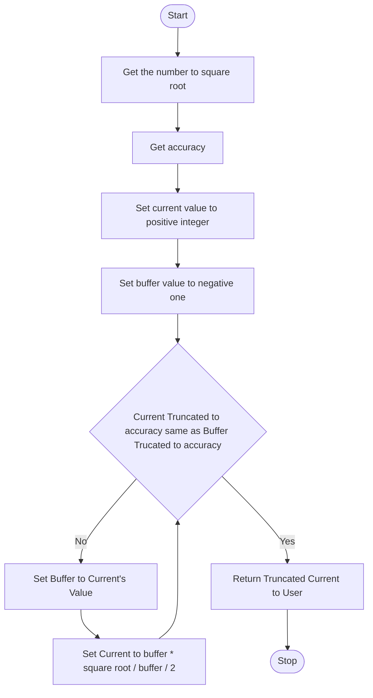

# Naming Conventions
Winging names of variables can end up in disaster. Write a list of variables names before writing a program or function. As well as this, you should do the same for function and module names.

## Example
### Problem
Function to find the square root using the Babylon Method

### Babylon Algorithm
$$ x_{n+1} = (x_n * S / x_n) / 2 $$
Use the following formula until $x_{n+1}$ and $x_n$ converge on an accuracy.

### Flowchart


### Variable Name list
|   Name   | Type                         |
|----------|------------------------------|
| babylon_algorithm | `float(uint input, int accuracy)` |
| input    | `uint`                         |
| accuracy | `int`                          |
| current  | `float`                         |
| buffer   | `float`                         |
| truncate | `float(float input, int accuracy)` |

### Pseudo-Code
```
FUNCTION babylon_algorithm
	GET input FROM USER
	GET accuracy FROM USER
	SET current TO 1
	SET buffer TO -1

	LOOP:
		TRUNCATE current TO accuracy DECIMAL PLACES
		TRUNCATE buffer TO accuracy DECIMAL PLACES
		IF TRUNCATED current AND TRUNCATED buffer ARE EQUAL
			RETURN TRUNCATED current
		ELSE
			SET buffer TO current
			SET current TO (buffer * input / buffer) / 2
	
```

### Implementation in C++
```cpp
#include <iostream>

float truncate(float input, int accuracy){
	// truncate logic
}

float(uint input, int accuracy){
	float current = 0;
	float buffer = -1;
	
	while(truncate(current, accuracy) != truncate(buffer, accuracy)){
		buffer = current;
		current = ((buffer * input) / buffer) / 2;
	}
	
	return truncate(current);
}
```