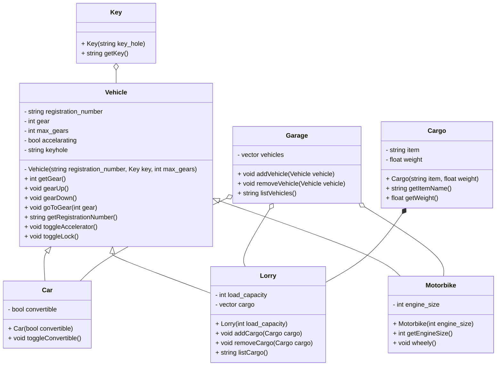

---
tags:
  - AQA-A-Level
  - Computer-Science
  - Task
  - Program
---


```mermaid
classDiagram
	Vehicle <|-- Car
	Vehicle <|-- Lorry
	Vehicle <|-- Motorbike 
	
	Garage o-- Car 
	Garage o-- Lorry 
	Garage o-- Motorbike 
	
	Key o-- Vehicle 
	Cargo *-- Lorry 
	
	class Garage{ 
		- vector<Vehicle> vehicles 
		+ void addVehicle(Vehicle vehicle) 
		+ void removeVehicle(Vehicle vehicle) 
		+ string listVehicles() 
	} 
	
	class Vehicle{
		- Vehicle(string registration_number, Key key, int max_gears)
		- string registration_number
		- int gear
		- int max_gears
		- bool accelarating
		- string keyhole
		+ int getGear()
		+ void gearUp()
		+ void gearDown()
		+ void goToGear(int gear)
		+ string getRegistrationNumber()
		+ void toggleAccelerator()
		+ void toggleLock()
	} 
	
	class Car{
		+ Car(bool convertible)
		- bool convertible
		+ void toggleConvertible()
	}
	
	class Lorry{
		+ Lorry(int load_capacity)
		- int load_capacity
		- vector<Cargo> cargo
		+ void addCargo(Cargo cargo)
		+ void removeCargo(Cargo cargo)
		+ string listCargo()
	}
	
	class Motorbike{
		+ Motorbike(int engine_size)
		- int engine_size
		+ int getEngineSize()
		 + void wheely()
	 } 
	 
	 class Key{
		 + Key(string key_hole)
		 + string getKey()
	} 
	
	class Cargo{
		+ Cargo(string item, float weight)
		- string item
		- float weight
		+ string getItemName()
		+ float getWeight()
	}
```

# oop_example.cpp
```cpp
```