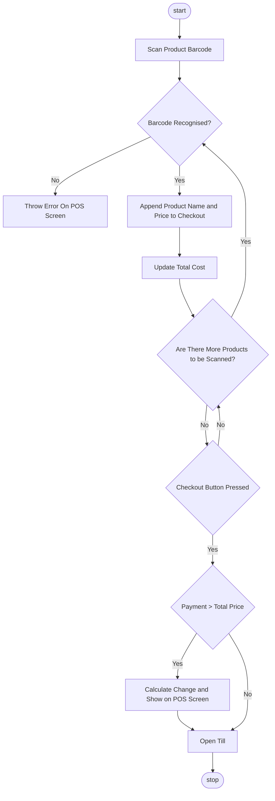
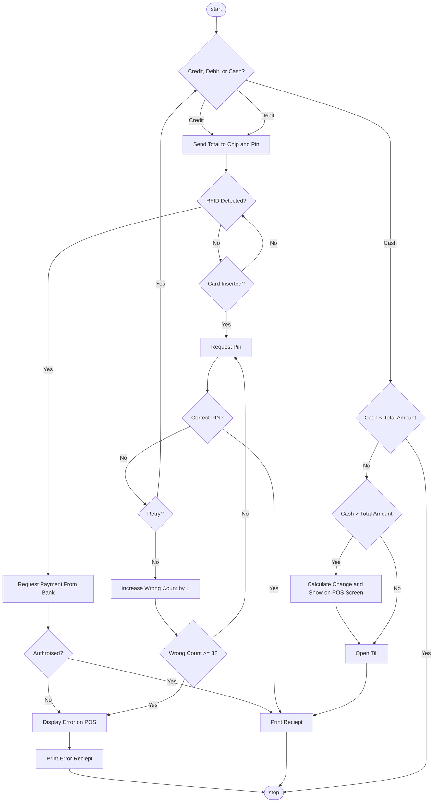

# POS

```mermaid
flowchart TD
	A([start]) --> B[Scan Product Barcode]
	B --> C{Barcode Recognised?}
	C -- No --> D[Throw Error On POS Screen]
	C -- Yes --> E[Append Product Name and Price to Checkout]
	E --> F[Update Total Cost]
	F --> G{Are There More Products to be Scanned?}
	G -- Yes --> C
	G -- No --> H{Checkout Button Pressed}
	H -- No --> G
	H -- Yes --> I{Payment > Total Price}
	I -- Yes --> J[Calculate Change and Show on POS Screen]
	J --> K[Open Till]
	I -- No --> K
	K --> L([stop])
	
```

# Credit or Debit 

```mermaid
flowchart TD
	start([start]) --> creditDebitCashQ{Credit, Debit, or Cash?}
	creditDebitCashQ -- Credit --> sendToChipAndPin[Send Total to Chip and Pin]
	creditDebitCashQ -- Debit --> sendToChipAndPin
	
	sendToChipAndPin --> rfidDetectedQ{RFID Detected?}
	
	rfidDetectedQ -- No --> cardInsertedQ{Card Inserted?}
	cardInsertedQ -- No --> rfidDetectedQ
	
	rfidDetectedQ -- Yes --> requestBank[Request Payment From Bank]
	requestBank --> authorisedQ{Authroised?}
	authorisedQ -- No --> posError[Display Error on POS]
	posError --> printErrorReciept[Print Error Reciept]
	
	authorisedQ -- Yes --> printReciept[Print Reciept]
	
	printErrorReciept --> stop([stop])
	printReciept --> stop
	
	cardInsertedQ -- Yes --> requestPin[Request Pin]
	requestPin --> pinCorrectQ{Correct PIN?}
	pinCorrectQ -- No --> retryQ{Retry?}
	retryQ -- Yes --> creditDebitCashQ
	retryQ -- No --> pinCounter[Increase Wrong Count by 1]
	pinCounter --> tooManyTriesQ{Wrong Count >= 3?}
	tooManyTriesQ -- No --> requestPin
	tooManyTriesQ -- Yes --> posError
	pinCorrectQ -- Yes --> printReciept
	
	creditDebitCashQ -- Cash --> tooLittleCashQ{Cash < Total Amount}
	tooLittleCashQ -- Yes --> stop
	tooLittleCashQ -- No --> tooMuchCashQ{Cash > Total Amount}
	
	tooMuchCashQ -- Yes --> calculateChange[Calculate Change and Show on POS Screen]
	calculateChange --> openTill[Open Till]
	openTill --> printReciept
	
	tooMuchCashQ -- No --> openTill
```
