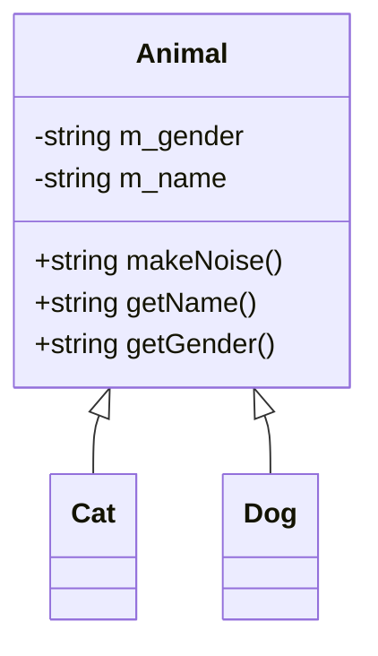

---
tags:
  - AQA-A-Level
  - Computer-Science
  - Chapter
page: 10
---
# Sections
- [[Programming Basics]]
- [[Programming Concepts]]
- [[Basic Operations in Programming Languages]]
- [[Subroutines, Local, and Global Variables]]
- [[Structured Programming]]
- [[Object-Oriented Programming Concepts]]

# Practice Questions
## Question 1
The following code is part of a stock control system.
```
Dim Name As String
Dim Price As Real
Const VAT = 0.2

Type RecordDetails
	RecordType As String * 14
	RecordCurrent As Integer
	RecordRestock As Integer
End Type
```

1. Identify where each of the following have been used, and explain why the type of variable chosen is appropriate
	- a variable that is used to store a whole number
		- The variable `RecordCurrent` is of type `Integer` because you will only have a whole number of products in a record.
	- a variable that is used to store a decimal number
		- The variable `price` is stored as a `Real` number, which a decimal part. This is because the price has to conform to two decimal places.

2. Why has a constant been used to store `VAT`?
	- This is because the `VAT` should never be needed to change during the programs lifetime as VAT is always 20%.

3. Some computer languages support *'"user-defined types"*. Explain this term and give an example of a user-defined variable in this code.
	- A user-defined type is a variable that stores custom data that isn't built into the programming language. For example, in the code, you have a type called `RecordDetails` that has custom data of `RecordType`, `RecordCurrent`, and `RecordRestock` which can be accessed when a variable is instantiated with it using dot syntax For example `RecordDetails record; cout << record.RecordCurrent << endl;`

## Question 2
A program has been written to analyse the results of a survey. For each of the following, name a suitable data type and give a reason for your choice.
1. The number of pets owned by a household
	- `uint`, as the number of pets owned will always be a whole number and never be negative.

2. A telephone number such as *0122453322*
	- `string`, as the phone number can have a leading 0, therefore it can't be stored as a number.

3. Whether a household's accommodation has central heating
	- `bool`, as the house either does (`true`) or does not (`false`) have central heating. The variable is binary.

4. The average number of children within a household
	- `float` or `double`, as the average may need a decimal part. The decision for a `float` or `double` depends on memory restraints and accuracy as a `double` takes 8 bytes while a `float` only uses 4 bytes.

## Question 3
It is considered poor design to define an Age field when storing personal details. Describe a better way of storing this data.
- You would be better of creating a `Date date_of_birth` field and using a method to calculate the age (`Date age = date_of_birth.getYear() - current.getYear()`). This would reduce the amount of information needing to be provided by the user and will be more useful to the developer.

## Question 4
What values can a boolean expression take?
- `true` or `false`.

## Question 5
The following section of pseudo-code is used to add and remove data in a queue. ‘routine to add to a circular queue  
```
// Routine to add to a circular queue

// Increment rear pointer
Rear = Rear + 1

// Check to see if the end of the array has been reached, if so go back to the
// start of the array
If Rear = 9 Then Rear = 0

// Add data
Put DataItem at position Rear in array

// Routine to remove data from circular queue
// Remove data
Take DataItem from position Front in array

// Move front on
Front = Front + 1

// Check to see if the end of the array has been reached, if so go back to the
// start of the array
If Front = 9 Then Front = 0
```

1. State a line of code that has a comment in it
	- Line 1

2. State a line of code that is an assignment statement
	- Line 4

3. State a conditional statement that has been used
	- `if` statement

4. An array contains the characters E, C and F, with the front pointer on E (at index 0 in the array) and the rear pointer on F (at index 2 in the array). Dry run the code above, showing what would happen if the characters A, D and G were added to the queue.

| State         | Front | Rear | Array              |
|---------------|-------|------|--------------------|
| Initial State | 0     | 2    | [E, C, F]          |
| Add 'A'       | 1     | 3    | [E, C, F, A]       |
| Add 'D'       | 2     | 4    | [E, C, F, A, D]    |
| Add 'G'       | 3     | 5    | [E, C, F, A, D, G] |
| Final State   | 3     | 5    | [E, C, F, A, D, G] |

5. Why is it a good idea to write programs in modules
	- To allow for multiple developers to work on the same project, and to make the functionality independent of the overall program. This also allows for reusability of the code as well as organisation.

## Question 6
Write a program to implement the pseudo-code in [[#Question 5]]
```cpp
#include <iostream>

class CircularQueue{
	public:
		CircularQueue(int size) :
			m_size(size),
			m_array(new char[size]),
			m_front(0)
			{
				char base[] = {'E', 'C', 'F'};
				int base_size = sizeof(base) / sizeof(base[0]);
				for(int i = 0; i < base_size; i++){
					m_array[i] = base[i];
				}
				
				m_rear = base_size - 1;
			}
		
		std::string printQueue(){
			std::string out;
			
			out += "Array: ";
			for(int i = 0; i < m_size; i++){
				if(i != 0){
					out += ", ";
				}
				
				if(m_array[i] == '\0'){
					out += "NULL";
				} else {
					out += m_array[i];
				}
			}
			out += "\n";
			
			out += "Front: " + std::to_string(m_front) + "\n";
			out += "Rear: " + std::to_string(m_rear) + "\n";
			
			return out;
		}
		
		void add(char in){
			// Incrememnt Rear Pointer, if at end, return to 0
			if(m_rear == m_size){
				m_rear = 0;
			} else {
				m_rear++;
			}
			
			// Add data to front of array
			m_array[m_rear] = in;
		}
		
		void remove(){
			// Remove data
			m_array[m_front] = '\0';
			
			// Incrememnt Front Pointer, if at end, return 0
			if(m_front == m_size){
				m_front = 0;
			} else {
				m_front++;
			}
		}
	
	private:
		int m_size;
		char* m_array;
		int m_front;
		int m_rear;
};

int main(){
	CircularQueue circle(6);
	
	// Add extra values from question 5.4
	char inputs[] = {'A', 'D', 'G'};
	for(char c : inputs){
		circle.add(c);
		std::cout << circle.printQueue() << std::endl;
	}
}

// OUTPUT:
//	 Array: E, C, F, A, NULL, NULL
//	 Front: 0
//	 Rear: 3
//
//	 Array: E, C, F, A, D, NULL
//	 Front: 0
//	 Rear: 4
//
//	 Array: E, C, F, A, D, G
//	 Front: 0
//	 Rear: 5
```

## Question 7
Explain what techniques programmers can use to assist with the design of a piece of software and how they can make their program code easy to follow
- Use [[Flowcharts]], [[Class Diagrams for Inheritance|Class Diagrams]], [[Pseudo-Code]], and [[Dry Runs and Trace Tables]]
- Follow design principles such as [[Design Principles#Encapsulate What Varies|Encapsulate What Varies]], [[Design Principles#Favour Composition Over Inheritance|Favouring Composition Over Inheritance]] , and [[Design Principles#Program to Interfaces, Not Implementation|Program to Interface, Not Implementation]].
- Follow clean code principles such as [[Clean Code Principles#DRY|Don't Repeat Yourself]], [[Clean Code Principles#KISS|Keep It Simple Stupid]], and [[Clean Code Principles#YAGNI|You Aren't Gonna Need It]]

## Question 8
Look at the following section of code and answer the following questions
```
For Loop1 = 1 To NameCount - 1
	For Loop2 = 1 To NameCount - 1
		If NameStore(Loop2) > NameStore(Loop2 + 1) Then
			TempStore = NameStore(Loop2)
			NameStore(Loop2) = NameStore(Loop2 + 1)
			NameStore(Loop2 + 1) = TempStore
		EndIf
	Next
Next
```
1. What two different data types are being used
	- An Integer for `Loopx`'s index, and an array of strings (I assume) for the `NameStore`.

2. What is the purpose of the first line of code?
	- The first line of code initialises `Loop1`'s `for` loop

3. What is the purpose of the second line of code?
	- The second line of code initialises `Loop2`'s `for` loop

4. What is the algorithm doing
	- The algorithm is sorting a list of strings called `NameStore` from the shortest character count to the largest.

## Question 9
Explain the difference between local and global variables
- A local variable is a variable that can only be accessed within the scope it wants to be manipulated in. A global variable is a variable that can be accessed from anywhere within the program. e.g.
```cpp
int OFFSET = 10; // This is a global variable

int add(int a){
	int x = a // x is a local variable to add() and can't be accessed within main
	return x + OFFSET
}

int main{
	add(12); // Return 22
}
```

## Question 10
An object-oriented programming language will be used to create a system related to animals
1. Suggest suitable properties and methods for a base class
	- gender, name, makeNoise()

2. Suggest two further subclasses that could be built from the base class
	- Cat and Dog

3. Explain the difference between an object and a class
	- An object is an instance of a class, a class builds objects.

4. Draw a class diagram to show your answers for 10.1 and 10.2


5. Give one example of inheritance in this example
	- All properties and methods from the Animal are given to the Cat and Dog classes.

6. Explain how an object can be instantiated
	- In C++, you can do the following: `Animal animal;`
	- If you have a constructor then you do the following: `Dog daisy("Female", "Daisy")`

7. Give one example of where toy may need to use overriding
	- The `makeNoise()` method will need to be overridden to make the correct sound for the animal. This can be done either abstractly or virtually.